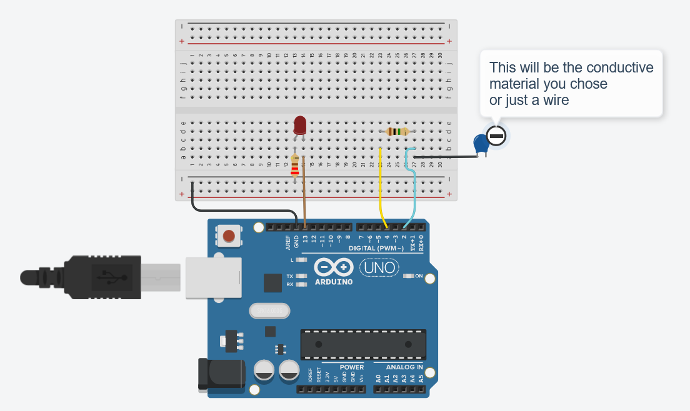

# Capacitive-sensor
Arduino code for Artssu workshop

## Set up 

To make this touch interactive LED you will need: 
- 1 Arduino Uno 
- 5 prototyping wires 
- 1 breadboard 
- 1 1M Ohms resistor
- 1 220 Ohms resistor
- 1 Led 

## Wiring 

## Code 
[Code](Code.ino)
